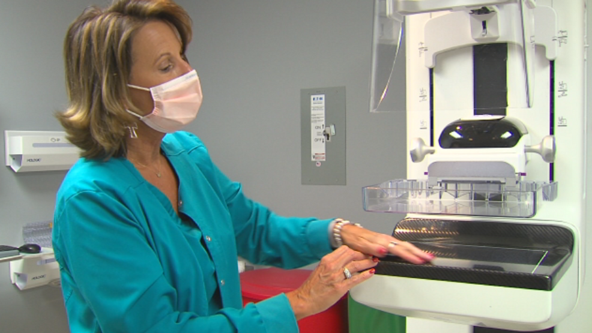

<!-- Find some data of interest to you that can be analyzed with a logistic regression. Complete your Logistic Regression Analysis using this file. 

Hint, run the command 

> data() 

in your Console to see available datasets in R that you could use for this Analysis. You are also welcome to collect data yourself, or find other available datasets online for this Analysis. Just be careful to not use anyone else's "analysis" for this Analysis. Also, no conducting surveys unless you have IRB approval to do so. -->

<script type="text/javascript">
 function showhide(id) {
    var e = document.getElementById(id);
    e.style.display = (e.style.display == 'block') ? 'none' : 'block';
 }
</script>
<br>

```{r, include=FALSE}
install.packages("DT")
library(DT)
library(pander)
library(mosaic)
library(tidyverse)
library(ResourceSelection) 

# Read the data
bcw <- read.csv("../../Data/BCW2.csv", header=TRUE)

# Add a new column for T/F diagnosis
bcw <- bcw %>%  
  mutate(diag = ifelse(diagnosis=="M", yes=1, no=0))
```

<figure>
<center>

</center>
<figcaption>Image from [WFXL-FOX 31](https://wfxl.com/news/local/phoebe-providing-hundreds-of-free-mammograms-this-month)</figcaption>
</figure>

<br/>

## Background

Mammograms are used to detect breast cancer earlier than a breast self-exam would. There is interest in using computers to assist in diagnosing breast cancer to eliminate the natural variation in interpretations between radiologists. 

Under the direction of Dr. William H. Wolberg of the University of Wisconsin, Clinical Sciences Center, characteristics of cell nuclei were "computed from a digitized image of a fine needle aspirate (FNA) of a breast mass."([UCI Machine Learning Repository](https://archive.ics.uci.edu/ml/datasets/Breast+Cancer+Wisconsin+%28Diagnostic%29)). 

According the data set summary at Kaggle:<br>
"Ten real-valued features are computed for each cell nucleus:<br>
<br>
a) radius (mean of distances from center to points on the perimeter)<br>
b) texture (standard deviation of gray-scale values)<br>
c) perimeter<br>
d) area<br>
e) smoothness (local variation in radius lengths)<br>
f) compactness (perimeter^2 / area - 1.0)<br>
g) concavity (severity of concave portions of the contour)<br>
h) concave points (number of concave portions of the contour)<br>
i) symmetry<br>
j) fractal dimension ("coastline approximation" - 1)<br>
<br>
The mean, standard error and "worst" or largest (mean of the three
largest values) of these features were computed for each image,
resulting in 30 features. For instance, field 3 is Mean Radius, field 13 is Radius SE, field 23 is Worst Radius."<br>
<br>

Using the [Breast Cancer Wisconsin (Diagonstic) Data Set](https://www.kaggle.com/uciml/breast-cancer-wisconsin-data) which was pulled from Kaggle, a logistic regression was performed to determine whether there is a relationship between the standard deviation of gray-scale values for the texture mean of the tissue and the diagnosis. In other words, "Can the standard deviation of the gray-scale values of the texture mean from a sample of a mass predict whether or not the patient's mass is malignant?" 

Regarding texture, breasts are made of fatty tissue, glandular tissue like ducts, and fibrous (connective) tissue. Less dense tissue like fat appears darker when imaged while more dense tissue like glands and ducts appear lighter when imaged just as lungs appear darker and ribs lighter on an x-ray. The data measures the texture with numbers representing standard deviations of gray-scale values. The data does not clearly state the unit of measurement, so this analysis uses "unit" as the unit of measurement for the texture mean.  

</div>

<a href="javascript:showhide('datatable')">Data Table <span style="font-size:8pt;">(click to view)</span></a>

<div id="datatable" style="display:none;">


Click the "Code" button to see the data.


```{r}
# datatable
datatable(bcw, options=list(lengthMenu = c(5,10,30)), extensions="Responsive")

```

## Model
The logistic regression model used to model the probability is as follows:
$$
  P(Y_i = 1|x_i) = \frac{e^{\beta_0+\beta_1 x_i}}{1+e^{\beta_0 + \beta_1 x_i}} = \pi_i
$$
For each observation of $i$, $x_i$ will be the gray-scale value, $Y_i = 0$ will indicate a benign mass, and $Y_i = 1$ will indicate a malignant (cancerous) mass.
<br>

## Analysis

#### Hypotheses

If $\beta_1$ equals zero, the $x_1$ value will not affect the probability of the mass being cancerous ($Y_i$).

$$
  H_0: \beta_1 = 0 \\
  H_a: \beta_1 \neq 0\\
  \alpha = 0.05
$$
<br>

#### Fitting the Model

The results of running the logistic regression are below:

```{r}
# model
my.glm <- glm(diag~texture_mean, data=bcw, family=binomial)
pander(summary(my.glm))
```
Inputing the estimated intercept, -5.126, and the texture mean, 0.2346, values into the model yields the following model for $\pi_i$:

$$
  P(Y_i = 1|x_i) \approx \frac{e^{-5.126+0.2346 x_i}}{1+e^{-5.126+0.2346}} = \hat{\pi}_i
$$
<br>
There is sufficient evidence that $\beta_1 \neq 0$ as the $p$-value for the test is significant.
$$p = 2.827e-19$$
<br>

#### Interpretation

A texture mean of 0 is not appropriate for this analysis as a digitized mass will have some gray-scale value; therefore, the value of $e^{b_0}$ cannot be interpreted. However, $e^{b_1}$ can be interpreted. $e^{b_1} = e^{0.2346} \approx 1.26$ means the odds of the mass being malignant increase by 26% for every 1 unit increase in the texture mean.

<br>
The plot below shows the logistic regression.


```{r}
palette(c("#4444444D", "#ff33774D")) #transparency 30%
# I removed pch=16 in the plot & legend at the teachers suggestion, but I prefer it in
plot(diag ~ texture_mean, data=bcw, col=as.factor(diag), ylab="Probability of Mass Being Malignant", xlab="Texture Mean (Standard Deviation of Gray-scale Values)", main="Logistic Regression of Breast Cancer Diagnosis and Texture Mean")
b <- my.glm$coefficients
curve(exp(b[1]+b[2]*x)/(1+exp(b[1]+b[2]*x)), add=TRUE)
legend("bottomright", col=c("#ff3377", "#444444"), pch=1, legend=c("Malignant", "Benign"), bty="n", text.col = c("#ff3377", "#444444"))
# Maybe try removing the frame and adding x and y axis lines
```
<br>

#### Goodness of Fit

The data contains many repeated values, but as the data is a continuous variable the fit was tested using the Hosmer-Lemeshow goodness of fit test which had the following results:

```{r}
# Instructor said to use H-L fit test because it was "a nice continuous variable"
# pander(pchisq(646.5, 567, lower.tail = FALSE))
pander(hoslem.test(my.glm$y, my.glm$fitted, g=10))

```
<br>
<br>

As the results are significant, the fit of the model is not good, meaning the results of the logistic regression are questionable.
<br>

## Conclusion

The results of the logistic regression yielded a $p$-value of 2.827e−19, sufficient evidence to reject the null. According to the regression, the odds of the mass being malignant increase by 26% for every 1 unit increase in the standard deviation of gray-scale values for the texture mean.<br> 

However, the deviance of goodness of fit test was also significant with a $p$-value of 1.235e-05 so the results of the regression are not reliable.

